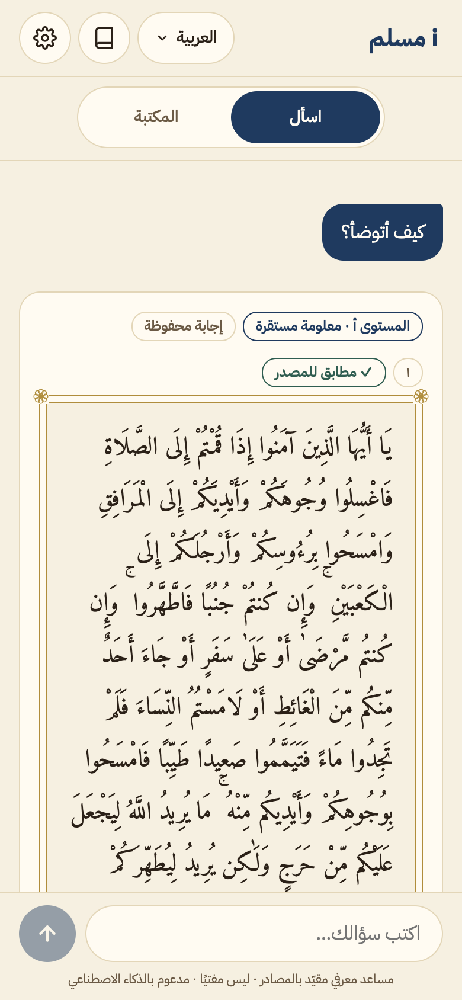
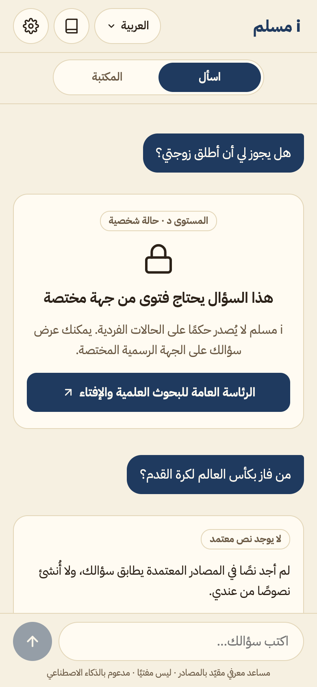

# مسلم

**الرابط الحي:** https://i-muslim.alkhammashtalal.workers.dev

<p>
  
  
</p>

> **الحالة الآن:** الإجابة من المحرك الحقيقي (بوابة المستوى، الاسترجاع، التحقق، النص من قاعدة البيانات). النموذج اللغوي في **وضع المحاكاة** إلى أن يُضاف مفتاحه، فاختيار المقاطع أول ما يعيده الاسترجاع، والشرح عند الطلب تجريبي موسوم.

## الفكرة

تطبيق «مسلم» مساعد معرفي مقيّد بالمصادر، **ليس مفتيًا**. تطبيق ويب قابل للتثبيت يجيب عن أسئلة التعريف بالإسلام وأركانه وعباداته من نصوص ثابتة فقط، ويعرض النص الأصلي بحروفه مع مرجعه ورابطه، ويُحيل إلى الجهة المختصة (alifta.gov.sa) حين يكون السؤال فتوى أو حين لا يجد نصًا. النموذج اللغوي لا يكتب نصًا شرعيًا؛ يختار أرقام المقاطع ويكتب شرحًا منها بشواهده، والنص يُعرض من قاعدة البيانات كما هو.

مشاركة في تحدي الذكاء الاصطناعي في خدمة المحتوى الإسلامي 2026 — المسار الأول «الحوار المعرفي والإجابات الموثوقة».

## كيف يعمل

1. **بوابة المستوى بلا نموذج:** أسئلة الحالة الشخصية والفتوى والخلاف تُحال فورًا إلى الجهة المختصة، ولا تُخزَّن.
2. **الاسترجاع:** بحث بالمعنى (bge-m3 في Vectorize) وبالكلمات (FTS5 على الآيات والتفسيرين والترجمة الإنجليزية) مع معجم يربط الصياغة اليومية بألفاظ المصادر؛ وإن لم يتجاوز شيء العتبة فاعتذار بلا استدعاء للنموذج. الأرقام في [`docs/METHODOLOGY.md`](docs/METHODOLOGY.md).
3. **استدعاء واحد للنموذج** يفهم السؤال بأي لغة، ويحدد المستوى ولغة الإجابة، ويختار أرقام المقاطع التي تجيبه، **ولا يكتب نصًا يُعرض**. ويُعامل نص السؤال بيانات لا تعليمات.
4. **التحقق:** رقم غير مرسَل يُحذف، والمستوى ج أو د إحالة بلا نص، والخلاف المعتبر يُصرَّح به وتُعرض النصوص بمراجعها.
5. **البطاقة من قاعدة البيانات:** النص بحروفه في إطار المصحف، ومرجعه ورابطه، والتفسير الميسر للآية بحروفه، ومعناها بالإنجليزية لغير العربية، وشارة «مطابق للمصدر» بعد مقارنة بايتية.
6. **الشرح عند الطلب فقط:** زر «بسّط لي» (وبغير العربية «اشرح لي بلغتي») يولّد شرحًا قصيرًا من نص التفسير أو المقطع وحده، موسومًا «شرح آلي» و«ترجمة آلية» لغير العربية والإنجليزية.

## الأقسام

- **اسأل:** محادثة بعشر لغات. الإجابة نص من المصدر بحروفه ومرجعه ورابطه، ثم التفسير الميسر للآية، ثم شرح مولّد موسوم منه وحده. ومعها لوحة «كيف وُجدت هذه الإجابة؟»: المقاطع المفحوصة وأيها استُعمل. سؤال الفتوى أو الحالة الشخصية يُحال، والمسألة الخلافية يُصرَّح بخلافها مع نصوصها.
- **المكتبة — القرآن الكريم:**
  - فهرس السور، والسورة بخط النسخ في وضعين («مصحف» و«آية آية»).
  - لمس الآية يفتح لوحتها: التفسير الميسر، وتفسير السعدي، والمعنى بالإنجليزية (Sahih International)، وروابط المصدر.
  - «اشرح لي بلغتي» لغير العربية: شرح آلي مبسّط من الميسر وحده، موسوم «ترجمة آلية».
  - يعمل بلا اتصال لما فُتح.
- **المكتبة — كتب العقيدة:** الأصول الثلاثة، وشروط الصلاة وأركانها (وتحت كل مقطع منها أن لأهل العلم في بعض تفاصيله أقوالًا أخرى)، والقواعد الأربع، وكتاب التوحيد، مقطعًا مقطعًا بنصها ورقم صفحة المطبوع ورابط الشاملة.
- **مسار البداية:** «جديد على الإسلام؟ ابدأ من هنا»: عشر خطوات، كل خطوة سؤال يمر بالمحرك نفسه. التقدم يُحفظ على الجهاز فقط.

## ما لا يفعله التطبيق

- **لا يفتي** ولا يحكم في حالة شخصية، ولا يرجّح بين أقوال أهل العلم؛ يُحيل إلى الرئاسة العامة للبحوث العلمية والإفتاء.
- **لا يكتب نصًا شرعيًا ولا يعدّله:** الآية والحديث والكتاب تُعرض من قاعدة البيانات بحروفها، والنموذج يختار أرقامها فقط.
- **لا يترجم الآيات ولا الأحاديث آليًا:** معنى الآية بالإنجليزية من Sahih International وحدها.
- **لا يجيب بلا نص:** إن لم يجد نصًا معتمدًا اعتذر وأحال، دون استدعاء النموذج.
- **لا يستعمل مصدرًا خارج القائمة الثابتة**، ولا يجمع بيانات شخصية (انظر [الخصوصية](docs/PRIVACY.md)).

## التشغيل المحلي

### ما يعمل بلا حساب Cloudflare

جُرّب من نسخة نظيفة مستنسخة من GitHub في 5 أكتوبر 2026. المتطلبات: Node.js 22.5 أو أعلى، و`git`.

```bash
git clone https://github.com/alkhammashtalal-sketch/i-muslim.git
cd i-muslim

# 1) الواجهة: تثبيت وبناء
cd web && npm install && npm run build

# 2) اختبارات الخادم
cd ../worker && npm install && npx vitest run

# 3) الواجهة محليًا بالبيانات التجريبية: http://localhost:5173
cd ../web && VITE_ASK_MODE=mock npm run dev
```

- قد يطبع npm تحذير `install-scripts`. لا يمنع البناء ولا الاختبارات.
- **الخطوة 2:** الاختبارات التي تحتاج النصوص كاملة تُتخطى، لأن `data/processed` خارج المستودع (في النسخة النظيفة: 66 ناجحة و23 متخطاة). لتشغيلها كلها اجلب النصوص أولًا كما في آخر هذا القسم.
- **الخطوة 3:**
  - المحادثة تعرض بيانات تجريبية موسومة «تجريبي»، ولا تتصل بأي خادم.
  - المكتبة (المصحف وكتب العقيدة) تحتاج الخادم. لقراءتها من الرابط الحي للقراءة فقط:
    `VITE_ASK_MODE=mock VITE_API_PROXY=https://i-muslim.alkhammashtalal.workers.dev npm run dev`
- **العينات:** `data/samples/` فيها 20 آية و20 مقطعًا بنسبتها، بصيغة ملفات البيانات نفسها، لمن يريد رؤية شكل البيانات دون جلب.
- **جلب النصوص كاملة (اختياري):** بلا حساب، ويحتاج `curl` و`unzip`. نحو 220 ميغابايت، وقراءة صفحات الشاملة بمعدل صفحة كل ثانيتين. التفاصيل في [`docs/SOURCES.md`](docs/SOURCES.md):

```bash
node scripts/ingest/ksu-fetch.mjs && node scripts/ingest/ksu-build.mjs
node scripts/ingest/shamela-fetch.mjs && node scripts/ingest/shamela-build.mjs
node scripts/ingest/validate.mjs   # ← data/processed/REPORT.md
```

### ما يحتاج حساب Cloudflare (خطة Workers Paid)

- **`npx wrangler dev` و`npx wrangler deploy`:** الخادم يربط Workers AI بعيدًا دائمًا (للتضمين)، فيطلب `npx wrangler login` أو متغير `CLOUDFLARE_API_TOKEN`. بدونهما يتوقف `wrangler dev` برسالة «it's necessary to set a CLOUDFLARE_API_TOKEN».
- **تشغيل نسخة على حسابك:** قاعدة D1 `imuslim` وفهرس Vectorize `imuslim-passages` في `worker/wrangler.jsonc` تخص حسابنا. للتشغيل على حسابك:
  1. أنشئ قاعدة D1، وفهرس Vectorize بأبعاد 1024 ومقياس `cosine`، وضع معرّف القاعدة في `wrangler.jsonc`.
  2. طبّق الترحيلات: `npx wrangler d1 migrations apply imuslim --remote`.
  3. اجلب النصوص كما أعلاه.
  4. افهرس بـ `scripts/index/run.mjs`. يحتاج `ADMIN_TOKEN`، والمسار الإداري مفتوحًا مؤقتًا بـ `ADMIN_ENABLED=true`.
  5. انشر: `npx wrangler deploy`.
- **الأسرار:** `IP_SALT` (للحد اليومي، ويحتاجه `/api/ask`)، و`LLM_API_KEY` (النموذج اللغوي، وبدونه يعمل `LLM_MODE=mock`)، و`ADMIN_TOKEN` (للفهرسة فقط). تُضاف بـ `npx wrangler secret put`، ومحليًا في `worker/.dev.vars` (خارج git). لا سرّ في المستودع.
- **`cd web && npx playwright test`:** اختبار شامل على الرابط الحي، أو على `BASE_URL`. يرسل أسئلة إلى المحرك فيُحسب من حده اليومي.

## المصادر

القرآن الكريم والتفسير الميسر وتفسير السعدي وترجمة Sahih International من مشروع آيات بجامعة الملك سعود؛ والأصول الثلاثة وشروط الصلاة وأركانها والقواعد الأربع وكتاب التوحيد من المكتبة الشاملة؛ والأحاديث من sunnah.com عبر واجهتهم البرمجية (لم تُجلب بعد)؛ والإحالة إلى alifta.gov.sa. القائمة الكاملة وأساسها النظامي في [`docs/COMPONENTS.csv`](docs/COMPONENTS.csv)، وطريقة الجلب في [`docs/SOURCES.md`](docs/SOURCES.md). النصوص لا تُنشر كاملة في هذا المستودع؛ يجلبها سكربت `scripts/ingest/`.

## الرخص والحقوق

- **الكود:** كود هذا المشروع وحده برخصة [MIT](LICENSE).
- **النصوص الشرعية لأصحابها:** نص القرآن والتفسيران والترجمة من مشروع آيات بجامعة الملك سعود، والكتب الأربعة من المكتبة الشاملة.
  - لا تشملها رخصة MIT، ولا تُنشر كاملة في المستودع.
  - تجلبها سكربتات `scripts/ingest/` من مصادرها الرسمية ([`docs/SOURCES.md`](docs/SOURCES.md)).
  - يُعرض في التطبيق كل مقطع برقمه ومرجعه ورابط صفحته الأصلية.
  - في المستودع عينات صغيرة للاختبار فقط (`data/samples/`، 20 لكل مصدر) مع نسبتها.
  - لم نجد لدى المصادر نص رخصة صريحًا. أساس عرضنا: المقطع برقمه ورابطه دون إعادة نشر الكتب، وهو ما أجازه المنظّمون ([`docs/ORGANIZER_QA.md`](docs/ORGANIZER_QA.md)، البند 5).
- **الخطوط:** IBM Plex Sans Arabic وAmiri برخصة SIL Open Font License 1.1، مستضافة ذاتيًا من حزم `@fontsource`.
- **المكتبات والخدمات والنماذج:** كل منها برخصته أو شروط خدمته في [`docs/COMPONENTS.csv`](docs/COMPONENTS.csv):
  - المكتبات برخص MIT وApache-2.0.
  - خدمات Cloudflare وDeepSeek بشروط خدماتها.
  - نموذج bge-m3 برخصة MIT.

انظر أيضًا: [المنهجية](docs/METHODOLOGY.md) · [القرارات التقنية](docs/DECISIONS.md) · [الإفصاح عن الذكاء الاصطناعي](docs/AI_USE.md) · [الخصوصية](docs/PRIVACY.md) · [نسخة البداية](docs/STARTING_VERSION.md) · [قائمة التحقق قبل التسليم](docs/SUBMISSION_CHECKLIST.md)

---

# Muslim (English)

**Live:** https://i-muslim.alkhammashtalal.workers.dev

> **Status:** answers come from the real engine (level gate, retrieval, verification, text from the database). The language model runs in **mock mode** until its key is added, so the passages are retrieval's first results and the on-request explanation is a labelled demo.

## Idea

The "Muslim" app is a source-bound knowledge assistant, **not a mufti**. An installable web app (PWA) that answers introductory questions about Islam, its pillars and acts of worship from a fixed set of sources only. It shows the original text verbatim with its reference and link, and refers fatwa-type questions (or questions with no matching text) to alifta.gov.sa. The LLM never writes religious text: it picks passage IDs and writes a cited explanation from them, while the text itself is rendered from the database exactly as stored.

Entry to the 2026 AI for Islamic Content Challenge — Track 1, "Knowledge Dialogue and Trustworthy Answers".

## How it works

1. **Level gate, no model:** personal-case, fatwa and disputed questions are referred at once and never cached.
2. **Retrieval:** meaning search (bge-m3 in Vectorize) plus keyword search (FTS5 over verses, both tafsirs and the English meanings), with a lexicon from everyday wording to the sources' terms; below the threshold the app apologises without calling the model. Numbers in [`docs/METHODOLOGY.md`](docs/METHODOLOGY.md).
3. **One model call** understands the question in any language, sets the level and the answer language, and chooses the passage ids that answer it — **it writes no displayed text**. The question is treated as data, not instructions.
4. **Verification:** ids that were not sent are dropped, level C/D becomes a referral with no text, and a recognised difference of opinion is stated with the texts and their references.
5. **Card from the database:** the text verbatim in the Mushaf frame, its reference and link, al-Muyassar for each verse verbatim, the English meaning outside Arabic, and a "matches source" badge after a byte comparison.
6. **Explanation on request only:** a "Simplify" / "Explain in my language" button writes a short explanation from the tafsir or passage text alone, labelled as machine-generated (and machine-translated outside Arabic and English).

## Sections

- **Ask:** a conversation in ten languages. Each answer shows the source text verbatim with its reference and link, then al-Muyassar for each verse, then a labelled explanation generated from those texts only. A "How was this answer found?" sheet lists the passages examined and which were used. Fatwa and personal questions are referred; disputed matters are stated as such, with their texts.
- **Library — the Holy Quran:**
  - The surah index, and each surah in naskh script in two modes ("Mushaf" and "ayah by ayah").
  - Tapping an ayah opens al-Muyassar, al-Saʿdi, the Sahih International meaning and the source links.
  - "Explain in my language" (non-Arabic): a simple machine explanation of al-Muyassar only, labelled "machine translation".
  - Readable offline once opened.
- **Library — Aqeedah books:** Thalathat al-Usul, Shurut al-Salah wa Arkanuha (each passage noting that scholars hold other views on some details), al-Qawa'id al-Arba' and Kitab al-Tawhid, passage by passage, with the printed page and a link to al-Shamela.
- **Start here:** "New to Islam? Start here": ten steps, each one a question sent to the same engine. Progress stays on the device.

## What the app does not do

- **No fatwas:** it does not rule on personal cases or choose between scholarly views; it refers to the General Presidency of Scholarly Research and Ifta.
- **No religious text written or edited by the model:** verses, hadith and book passages are rendered verbatim from the database; the model only picks their ids.
- **No machine translation of verses or hadith:** the English meaning is Sahih International only.
- **No answer without a text:** with no approved text, it apologises and refers, without calling the model.
- **No sources outside the fixed list, and no personal data** (see [Privacy](docs/PRIVACY.md)).

## Run locally

### Without a Cloudflare account

Tested from a clean clone on 5 October 2026. Requires Node.js 22.5+ and `git`.

```bash
git clone https://github.com/alkhammashtalal-sketch/i-muslim.git
cd i-muslim

# 1) Front end: install and build
cd web && npm install && npm run build

# 2) Worker tests
cd ../worker && npm install && npx vitest run

# 3) Front end locally with demo data: http://localhost:5173
cd ../web && VITE_ASK_MODE=mock npm run dev
```

- npm may print an `install-scripts` warning. It does not affect the build or the tests.
- **Step 2:** tests that need the full texts are skipped, because `data/processed` is not in the repository (clean clone: 66 passed, 23 skipped). Fetch the texts first, as at the end of this section, to run them all.
- **Step 3:**
  - The chat shows labelled demo data and calls no server.
  - The Library (Quran and creed books) needs the Worker. To read it from the live link, read-only:
    `VITE_ASK_MODE=mock VITE_API_PROXY=https://i-muslim.alkhammashtalal.workers.dev npm run dev`
- **Samples:** `data/samples/` holds 20 verses and 20 passages, attributed, in the same format as the data files.
- **Full texts (optional):** no account needed; requires `curl` and `unzip`. About 220 MB, and the Shamela pages are read at one page every 2 seconds. Details in [`docs/SOURCES.md`](docs/SOURCES.md):

```bash
node scripts/ingest/ksu-fetch.mjs && node scripts/ingest/ksu-build.mjs
node scripts/ingest/shamela-fetch.mjs && node scripts/ingest/shamela-build.mjs
node scripts/ingest/validate.mjs   # → data/processed/REPORT.md
```

### With a Cloudflare account (Workers Paid)

- **`npx wrangler dev` and `npx wrangler deploy`:** the Worker always binds Workers AI remotely (embeddings), so wrangler needs `npx wrangler login` or `CLOUDFLARE_API_TOKEN`. Without them, `wrangler dev` stops with "it's necessary to set a CLOUDFLARE_API_TOKEN".
- **Running your own copy:** the D1 database `imuslim` and the Vectorize index `imuslim-passages` in `worker/wrangler.jsonc` belong to our account. On your account:
  1. Create a D1 database and a 1024-dimension `cosine` Vectorize index, and put the database id in `wrangler.jsonc`.
  2. Apply the migrations: `npx wrangler d1 migrations apply imuslim --remote`.
  3. Fetch the texts as above.
  4. Index with `scripts/index/run.mjs`. It needs `ADMIN_TOKEN` and the admin route temporarily open with `ADMIN_ENABLED=true`.
  5. Deploy: `npx wrangler deploy`.
- **Secrets:** `IP_SALT` (daily limit, required by `/api/ask`), `LLM_API_KEY` (language model; without it `LLM_MODE=mock`), and `ADMIN_TOKEN` (indexing only). Add them with `npx wrangler secret put`, or locally in `worker/.dev.vars` (git-ignored). No secret is in the repository.
- **`cd web && npx playwright test`:** end-to-end against the live link, or `BASE_URL`. It sends questions to the engine, so they count against its daily limit.

## Sources

Quran, Tafsir al-Muyassar, Tafsir al-Saadi and Sahih International from the Ayat project (King Saud University); Thalathat al-Usul, Shurut al-Salah wa Arkanuha, al-Qawa'id al-Arba' and Kitab al-Tawhid from al-Maktaba al-Shamela; hadith from sunnah.com via its API (not fetched yet); referrals to alifta.gov.sa. Full list and legal basis in [`docs/COMPONENTS.csv`](docs/COMPONENTS.csv). Full source texts are not published in this repository; they are fetched by `scripts/ingest/`.

## Licenses and rights

- **Code:** only this project's code is under the [MIT](LICENSE) license.
- **Religious texts belong to their sources:** the Quran text, both tafsirs and the English meanings come from King Saud University's Ayat project; the four books come from al-Maktaba al-Shamela.
  - They are not covered by the MIT license, and they are not published in full in this repository.
  - The `scripts/ingest/` scripts fetch them from their official sources ([`docs/SOURCES.md`](docs/SOURCES.md)).
  - The app shows each passage with its number, reference and a link to its original page.
  - The repository holds small attributed test samples only (`data/samples/`, 20 per source).
  - We found no explicit license text from the sources. Our basis: showing a passage with its number and link without republishing the books, which the organisers accepted ([`docs/ORGANIZER_QA.md`](docs/ORGANIZER_QA.md), item 5).
- **Fonts:** IBM Plex Sans Arabic and Amiri under the SIL Open Font License 1.1, self-hosted from `@fontsource` packages.
- **Libraries, services and models:** each with its license or terms of service in [`docs/COMPONENTS.csv`](docs/COMPONENTS.csv):
  - libraries under MIT and Apache-2.0,
  - Cloudflare and DeepSeek under their terms of service,
  - the bge-m3 model under MIT.
