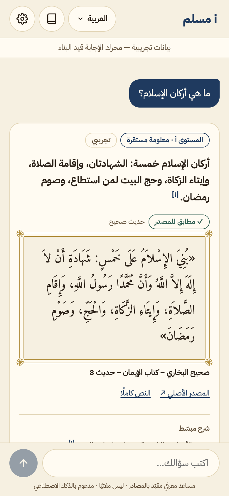
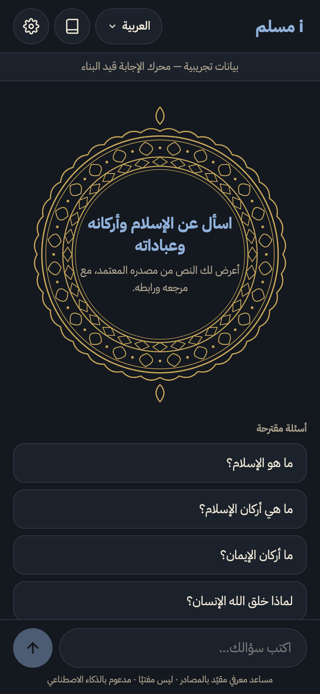
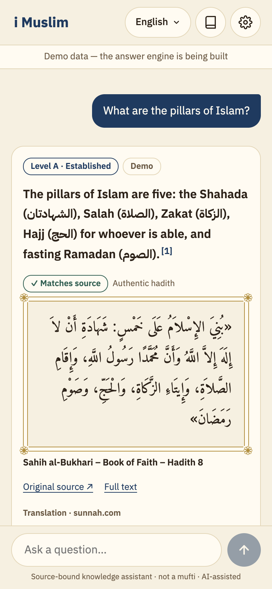

# i مسلم

**الرابط الحي:** https://i-muslim.alkhammashtalal.workers.dev

<p>
  
  
  
</p>

> الواجهة تعمل الآن على بيانات تجريبية موسومة إلى أن يكتمل محرك الإجابة.

## الفكرة

«i مسلم» مساعد معرفي مقيّد بالمصادر، **ليس مفتيًا**. تطبيق ويب قابل للتثبيت يجيب عن أسئلة التعريف بالإسلام وأركانه وعباداته من نصوص ثابتة فقط، ويعرض النص الأصلي بحروفه مع مرجعه ورابطه، ويُحيل إلى الجهة المختصة (alifta.gov.sa) حين يكون السؤال فتوى أو حين لا يجد نصًا. النموذج اللغوي لا يكتب نصًا شرعيًا؛ يختار أرقام المقاطع ويكتب شرحًا منها بشواهده، والنص يُعرض من قاعدة البيانات كما هو.

مشاركة في تحدي الذكاء الاصطناعي في خدمة المحتوى الإسلامي 2026 — المسار الأول «الحوار المعرفي والإجابات الموثوقة».

## التشغيل المحلي

المتطلبات: Node.js 20 أو أعلى، وحساب Cloudflare.

```bash
# الواجهة
cd web && npm install && npm run build

# الخادم (يقدّم web/dist ومسارات /api/*)
cd ../worker && npm install
npx wrangler login
npx wrangler dev
# ثم افتح http://localhost:8787 و http://localhost:8787/api/health
```

للتطوير على الواجهة وحدها: `cd web && npm run dev`. وللبناء على محرك الإجابة الحقيقي بدل البيانات التجريبية: `VITE_ASK_MODE=live npm run build`.

الأسرار (مثل `LLM_API_KEY`) لا تُحفظ في المستودع، وتُضاف بـ `npx wrangler secret put`، ومحليًا في `worker/.dev.vars` (خارج git).

## المصادر

القرآن الكريم والتفسير الميسر وتفسير السعدي وترجمة Sahih International من مشروع آيات بجامعة الملك سعود؛ والأحاديث من sunnah.com عبر واجهتهم البرمجية؛ والأصول الثلاثة والقواعد الأربع وكتاب التوحيد من المكتبة الشاملة؛ والإحالة إلى alifta.gov.sa. القائمة الكاملة وأساسها النظامي في [`docs/COMPONENTS.csv`](docs/COMPONENTS.csv). النصوص لا تُنشر كاملة في هذا المستودع؛ يجلبها سكربت `scripts/ingest/`.

## الرخصة

كود المشروع برخصة [MIT](LICENSE). النصوص الشرعية ليست جزءًا من المستودع ولا تشملها الرخصة.

انظر أيضًا: [الإفصاح عن الذكاء الاصطناعي](docs/AI_USE.md) · [الخصوصية](docs/PRIVACY.md) · [نسخة البداية](docs/STARTING_VERSION.md)

---

# i Muslim (English)

**Live:** https://i-muslim.alkhammashtalal.workers.dev (currently on labelled demo data until the answer engine lands)

## Idea

"i Muslim" is a source-bound knowledge assistant, **not a mufti**. An installable web app (PWA) that answers introductory questions about Islam, its pillars and acts of worship from a fixed set of sources only. It shows the original text verbatim with its reference and link, and refers fatwa-type questions (or questions with no matching text) to alifta.gov.sa. The LLM never writes religious text: it picks passage IDs and writes a cited explanation from them, while the text itself is rendered from the database exactly as stored.

Entry to the 2026 AI for Islamic Content Challenge — Track 1, "Knowledge Dialogue and Trustworthy Answers".

## Run locally

Requires Node.js 20+ and a Cloudflare account.

```bash
cd web && npm install && npm run build
cd ../worker && npm install
npx wrangler login
npx wrangler dev   # http://localhost:8787 and /api/health
```

Secrets (e.g. `LLM_API_KEY`) are never committed; use `npx wrangler secret put`, or `worker/.dev.vars` locally (git-ignored).

## Sources

Quran, Tafsir al-Muyassar, Tafsir al-Saadi and Sahih International from the Ayat project (King Saud University); hadith from sunnah.com via its API; Thalathat al-Usul, al-Qawa'id al-Arba' and Kitab al-Tawhid from al-Maktaba al-Shamela; referrals to alifta.gov.sa. Full list and legal basis in [`docs/COMPONENTS.csv`](docs/COMPONENTS.csv). Full source texts are not published in this repository; they are fetched by `scripts/ingest/`.

## License

Project code is [MIT](LICENSE). Religious source texts are not part of this repository and not covered by the license.
